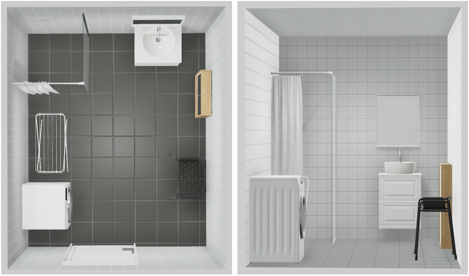

# PerCom 2026 — A Privacy-Preserving Multimodal Fall Detection Framework in Bathrooms  

> **Notice:** Our manuscript is currently under peer review (IEEE PerCom 2026). In the meantime, we have released the full training/evaluation code, preprocessing pipelines, and model implementations for early access and community feedback. We warmly invite reviewers and fellow researchers to explore the repository, reproduce our results, and open issues/PRs.  
> **Dataset:** The synchronized mmWave–vibration dataset will be made publicly available upon publication.

## Table of Contents
- [1. Introduction](#1-introduction)
- [2. Motivation and Background](#2-motivation-and-background)
- [3. Multimodal Sensor Selection](#3-multimodal-sensor-selection)
- [4. System Setup and Dataset Collection](#4-system-setup-and-dataset-collection)
  - [4.1 Participants](#41-participants)
  - [4.2 Dataset Scale and Release Plan](#42-dataset-scale-and-release-plan)
- [5. Experimental Design](#5-experimental-design)
- [6. Model Architecture](#6-model-architecture)
  - [6.1 Radar (Motion–Mamba) Stream](#61-radar-motionmamba-stream)
  - [6.2 Vibration (Impact–Griffin) Stream](#62-vibration-impactgriffin-stream)
  - [6.3 Cross-Conditioned Fusion & Classifier](#63-cross-conditioned-fusion--classifier)
- [7. Results and Performance](#7-results-and-performance)
  - [7.1 Scenario-wise Metrics](#71-scenario-wise-metrics)
  - [7.2 Comparison with State-of-the-Art](#72-comparison-with-state-of-the-art)
  - [7.3 Ablation Study](#73-ablation-study)
- [8. Conclusion and Future Work](#8-conclusion-and-future-work)

---

## 1. Introduction
Falls are a major hazard for older adults living independently, with bathrooms posing the **highest risk** due to wet floors, hard surfaces, and confined geometry. **CAMF-SR** (Context-Aware Multimodal Fusion with Sparse Routing) is a **privacy-preserving** fall detection system that fuses **mmWave radar** (pre-impact motion) and **floor vibration** (impact evidence). Our design enforces **collapse–impact temporal consistency** via **cross-conditioned fusion**, and achieves **high precision** while keeping **latency predictable** for embedded deployment.

---

## 2. Motivation and Background
Wearables are often not worn in bathrooms; cameras/microphones are unsuitable due to privacy concerns; and unimodal ambient sensing (radar **or** vibration) struggles with confounders (object drops, water-induced clutter, floor resonance). We therefore pursue a **multimodal** approach that jointly captures **long-horizon motion** and **short, high-energy impacts** while explicitly modeling their temporal relationship.

---

## 3. Multimodal Sensor Selection
We systematically assessed 14 common ambient sensing modalities, including Wi-Fi CSI, infrared, thermal imaging, pressure mats, acoustic sensing, mmWave radar, and vibration sensors. Each modality was evaluated against seven key criteria: target relevance, recall under noisy conditions, deployability in wet and constrained bathroom spaces, inherent privacy preservation, device availability, energy efficiency, and overall cost. While several modalities showed promise, most were limited by either poor robustness in wet environments (e.g., acoustic sensing), low privacy (e.g., cameras, thermal imaging), or low deployability (e.g., floor mats). The final selection—FMCW mmWave radar and triaxial vibration sensors—achieved the highest composite usability score. Radar provides reliable pre-impact kinematics by capturing body motion trajectories, while vibration sensors offer high-SNR signatures of localized impacts. This complementary pairing ensures both macro-motion and micro-impact cues are captured, enabling privacy-preserving yet highly accurate fall detection in bathrooms.

---

## 4. System Setup and Dataset Collection
Experiments were conducted in a full-scale bathroom mock-up (approx. **3.70 × 2.50 m**), with ceramic tiles, glass partition, and running water.

- **mmWave radar node:** wall-mounted near ceiling (~**2.45 m** height), unobstructed FoV.  
- **Vibration node:** triaxial accelerometer mounted on **shower platform** near floor, maximizing coupling to footfall/impacts.  
- Waterproofed enclosures; synchronized microcontroller clocks; in-situ calibration.

### 4.1 Participants  
A total of 48 healthy volunteers (24 male, 24 female) participated in the experiments.  
Table I summarizes their demographics, showing balanced gender distribution and similar anthropometrics across groups.  
This design ensured unbiased data collection and reliable evaluation of the proposed system.  

| Characteristic      | All (N=48)     | Male (n=24)   | Female (n=24) |
|---------------------|----------------|---------------|---------------|
| Age (years)         | 25 ± 5         | 25 ± 5        | 25 ± 5        |
| Height (m)          | 1.69 ± 0.7     | 1.70 ± 0.6    | 1.66 ± 0.4    |
| Body mass (kg)      | 68.5 ± 9.7     | 75.2 ± 6.1    | 61.8 ± 5.4    |
| BMI (kg/m²)         | 23.1 ± 2.6     | 23.7 ± 2.0    | 22.4 ± 1.9    |
| Dominant hand (R/L) | 5 / 1          | 3 / 0         | 2 / 1         |

### 4.2 Dataset Scale and Release Plan  
In total, more than **3 hours** of synchronized multimodal data were collected, comprising ~**1.1×10^5 radar frames** (≈12.5 Hz) and **3.1×10^6 vibration samples** (100 Hz).  
Each sequence was annotated with frame-level labels (±250 ms tolerance) and split into subject-independent subsets (**60% training, 20% validation, 20% testing**).  
The dataset will be publicly released upon acceptance of the paper to enable full reproducibility and future benchmarking.  

---

## 5. Experimental Design
Experiments were conducted in a full-scale bathroom mock-up with tiled walls, a glass partition, and a continuously running shower under wet-floor conditions to replicate realistic risks. We designed nine scenarios covering both non-fall and fall activities: an empty baseline, light and heavy object drops, normal walking, bent-posture walking, wall-supported walking, static standing, squatting, and intentional falls. Each non-empty scenario comprised multiple trials lasting 20–120 seconds to ensure variability. Falls were performed under the supervision of a trained spotter with safety padding in place. Radar and vibration streams were tightly synchronized, and frame-level annotations were derived by aligning vibration energy peaks with radar motion cues. In total, the protocol yielded over 3 hours of multimodal data (~1.1×10⁵ radar frames and ~3.1×10⁶ vibration samples), establishing a rigorous benchmark for privacy-preserving fall detection in wet bathroom environments.

Each non-empty scenario has multiple trials (20–120 s). Falls were performed with a trained spotter and safety padding.

---

## 6. Model Architecture

CAMF-SR is a **dual-stream** model with **linear-time temporal modeling** and **sparse expert routing**:

- **Motion–Mamba (radar)**: Large Selective Kernel (LSK1D) front end → **state-space** temporal blocks (Mamba-like) → Switch–MoE adapter + attention pooling.
- **Impact–Griffin (vibration)**: LSK1D front end → **GLRU/HGRU2** memory + local attention → **Inter-Channel Attention (ICA)** → attention pooling.
- **Fusion**: **Cross-conditioned** sequence interaction within a local window → **low-rank bilinear** token coupling → **Fusion Switch–MoE** → fall head.

### 6.1 Radar (Motion–Mamba) Stream
- **Goal:** capture **pre-impact** collapse kinematics without quadratic attention cost.  
- **Blocks:** LSK1D (multi-scale receptive fields) → Mamba2Block1D (linear-time long dependencies) → Switch–MoE + attention pooling.

### 6.2 Vibration (Impact–Griffin) Stream
- **Goal:** preserve **sharp transients** and short ringing; adapt to cross-axis coupling.  
- **Blocks:** LSK1D → GriffinBlock1D (GLRU memory + local self-attn) → **ICA** (covariance-normalized channel weighting) → attention pooling.

### 6.3 Cross-Conditioned Fusion & Classifier
- **Cross-conditioning:** vibration onsets steer radar aggregation; radar macro-motion sharpens impact emphasis.  
- **Low-rank bilinear (MLB):** multiplicative token interaction with rank constraints.  
- **Fusion Switch–MoE:** routes contexts to specialized experts with a lightweight auxiliary balance loss.  
- **Head:** sigmoid classifier for fall vs. non-fall.

---

## 7. Results and Performance

### 7.1 Scenario-wise Metrics
Heavy object drops are the most confounding (high-energy nonhuman impacts), while locomotion/squatting maintain high F1 with fused cues.

| Scenario             | Eval. Windows (N) | Non-Fall Accuracy | Non-Fall Precision | Non-Fall Recall | Non-Fall F1 | Fall Accuracy | Fall Precision | Fall Recall | Fall F1 |
|----------------------|-------------------|-------------------|--------------------|-----------------|-------------|---------------|----------------|-------------|---------|
| Empty Bathroom       | 218  | 97.10 | 96.55 | 90.32 | 93.33 | 97.10 | 96.55 | 90.32 | 93.33 |
| Light Object Drop    | 498  | 96.38 | 93.33 | 90.32 | 91.80 | 96.38 | 93.33 | 90.32 | 91.80 |
| Heavy Object Drop    | 380  | 91.30 | 88.00 | 70.97 | 78.57 | 91.30 | 88.00 | 70.97 | 78.57 |
| Normal Walking       | 1188 | 97.83 | 96.67 | 93.55 | 95.08 | 97.83 | 96.67 | 93.55 | 95.08 |
| Bent Posture Walk    | 896  | 94.93 | 92.86 | 83.87 | 88.14 | 94.93 | 92.86 | 83.87 | 88.14 |
| Wall-Supported Walk  | 610  | 97.08 | 95.87 | 87.10 | 91.27 | 97.08 | 96.13 | 87.10 | 91.34 |
| Static Standing      | 617  | 96.35 | 96.43 | 87.10 | 91.53 | 96.35 | 96.43 | 87.10 | 91.53 |
| Squatting            | 291  | 96.27 | 94.33 | 96.77 | 95.53 | 96.27 | 95.82 | 96.77 | 96.29 |
| **Total (simple mean)**   | --   | 95.91 | 94.97 | 87.50 | 90.66 | 95.89 | 95.19 | 87.50 | 90.76 |
| **Total (weighted mean)** | --   | 96.17 | 94.60 | 87.90 | 91.06 | **96.09** | **94.82** | **87.90** | **91.12** |

Table II presents the scenario-wise evaluation in wet bathroom environments. The results highlight the robustness of CAMF-SR, maintaining >95% accuracy across most daily activities, while significantly outperforming in challenging cases like heavy object drops, achieving a weighted F1 of 91.12%.

### 7.2 Comparison with State-of-the-Art
CAMF-SR matches the strongest radar-only systems on accuracy but **exceeds prior privacy-preserving baselines in precision and F1**, reducing false alarms in wet, cluttered bathrooms.

| Author | Model | Detection Method | Accuracy (%) | Precision (%) | Recall (%) |
|--------|-------|------------------|--------------|---------------|------------|
| Rezaei et al. | CNN | mmWave Radar | 88.7 | 69.9 | 85.5 |
| Maitre et al. | CNN–LSTM | UWB Radar | 77.0 | 86.0 | 89.0 |
| Yao et al. | Range–vertical angle map cls. | mmWave Radar | 86.7 | 84.7 | 88.9 |
| Li et al. | CNN–LSTM | mmWave Radar | **96.8** | 84.6 | 89.6 |
| He et al. | RBF Neural Net | Radar Sensor | 85.9 | 88.3 | 82.8 |
| Clemente et al. | Multiclass SVM | Smart Seismic Sensing | 91.2 | 74.2 | 73.7 |
| Hanif et al. | SVM | CW Doppler Radar | 89.0 | 88.0 | 87.0 |
| Wang et al. | Transformer | mmWave Radar | 94.5 | 94.2 | 86.7 |
| Sadreazami et al. | CNN | UWB Radar | 82.9 | 92.8 | 81.2 |
| Swarubini et al. | ResNet-50 | UWB Radar | 67.2 | 50.6 | **98.8** |
| Yang et al. | Bi-LSTM+CNN | mmWave Radar | 93.1 | 93.8 | 91.3 |
| Dai et al. | Improved YOLOX | mmWave Radar + Vision | 93.4 | 94.6 | 95.6 |
| Sun et al. | Attention–GRU | Multimodal Sensor Fusion | 94.2 | 92.4 | 83.8 |
| Meng et al. | CNN–LSTM–Attn | Wi-Fi CSI + Accelerometer | 93.1 | 94.3 | 91.2 |
| Alkhaldi et al. | ResNet-18 | mmWave Radar | 93.0 | 91.4 | 90.2 |
| Zhang et al. | Att-CNN-LSTM | FMCW Radar | 93.5 | 90.2 | 86.7 |
| **Ours (CAMF-SR)** | **Our Method** | **mmWave Radar + Vibration** | _96.1_ | _**94.8**_ | _87.9_ |

Table III compares CAMF-SR with 16 prior fall detection methods across various sensing modalities. Our framework achieves the second-highest accuracy (96.1%), the highest precision (94.8%), and competitive recall, demonstrating its strong ability to reduce false alarms while maintaining reliable detection in bathroom environments.

### 7.3 Ablation Study
We ablate **LR-temporal blocks**, **MoE+Attention**, **ICA**, and the **fusion stack**. Cross-conditioning + MLB notably boosts F1; the fusion Switch–MoE contributes additional robustness at constant-time inference.

| LSK1D | LR-Temporal | MoE+Attn | ICA | X-Cond+MLB | Fusion-MoE | Vibration | Radar | Accuracy (%) | Precision (%) | Recall (%) | F1 (%) |
|-------|-------------|----------|-----|------------|------------|-----------|-------|--------------|---------------|------------|--------|
| ✔ | ✔ | ✔ | ✔ |   |   | ✔ |   | 92.4 | 85.1 | 82.1 | 83.6 |
| ✔ | ✔ | ✔ |   |   |   |   | ✔ | 86.9 | 66.7 | 88.0 | 75.8 |
| ✔ | ✔ |   | ✔ |   |   | ✔ |   | 90.7 | 87.2 | 78.9 | 82.9 |
| ✔ |   | ✔ | ✔ |   |   | ✔ |   | 84.7 | 71.2 | 52.8 | 60.4 |
| ✔ |   | ✔ |   |   |   |   | ✔ | 80.5 | 67.1 | 83.9 | 74.5 |
| ✔ | ✔ | ✔ | ✔ |   |   | ✔ | ✔ | 90.4 | 88.5 | 80.0 | 84.1 |
| ✔ | ✔ | ✔ | ✔ | ✔ |   | ✔ | ✔ | 93.8 | 91.8 | 84.2 | 87.8 |
| ✔ | ✔ | ✔ | ✔ | ✔ |   | ✔ | ✔ | 95.1 | 93.2 | 91.0 | 92.1 |
| ✔ | ✔ | ✔ | ✔ | ✔ | ✔ | ✔ | ✔ | **96.1** | **94.8** | **87.9** | **91.1** |

Table IV highlights the ablation results. Removing key modules or sensor modalities leads to significant performance drops, while the full CAMF-SR model with all components achieves the best results (Accuracy 96.1%, Precision 94.8%, F1 91.1), demonstrating the critical role of both radar–vibration fusion and cross-conditioned MoE design.

---

## 8. Conclusion and Future Work
CAMF-SR delivers **alignment-aware**, **computationally bounded** fusion for bathroom fall detection without cameras or wearables. It consistently reduces false alarms from object drops and water-induced clutter while keeping sensitivity high. Future directions include broader population studies, adaptive synchronization under drift, and additional privacy-preserving modalities for generalization across bathrooms and installations.

---
