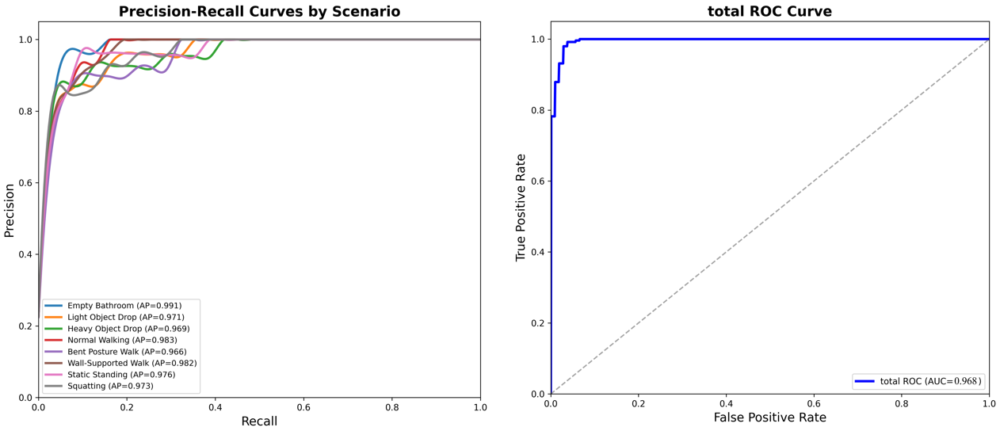

# ICRA 2026 — A Privacy-Preserving Multimodal Fall Detection Framework in Bathrooms  

> **Notice:** This repository hosts the official implementation of our ICRA 2026 paper.  
> The full dataset and pretrained models will be released upon publication.  
> In the meantime, we provide **data-processing pipelines, feature-extraction scripts, and the proposed dual-branch model** for reproducibility and community feedback.  

---

## Table of Contents
- [1. Introduction](#1-introduction)  
- [2. Motivation and Background](#2-motivation-and-background)  
- [3. Multimodal Sensor Setup](#3-multimodal-sensor-setup)  
- [4. Dataset Collection](#4-dataset-collection)  
- [5. Model Architecture](#5-model-architecture)  
  - [5.1 Radar Stream (Motion–Mamba)](#51-radar-stream-motionmamba)  
  - [5.2 Vibration Stream (Impact–Griffin)](#52-vibration-stream-impactgriffin)  
  - [5.3 Cross-Modal Fusion](#53-cross-modal-fusion)  
- [6. Experimental Design](#6-experimental-design)  
- [7. Results and Performance](#7-results-and-performance)  
  - [7.1 Scenario-wise Metrics](#71-scenario-wise-metrics)  
  - [7.2 Comparison with State-of-the-Art](#72-comparison-with-state-of-the-art)  
  - [7.3 Ablation Study](#73-ablation-study)  
- [8. Conclusion and Future Work](#8-conclusion-and-future-work)  

---

## 1. Introduction
Falls in bathrooms represent a **critical health risk** for older adults. Over 80% of indoor falls occur in bathrooms, where **wet floors, confined spaces, and hard surfaces** magnify the danger.  

Our proposed system introduces a **privacy-preserving multimodal fall detection framework (Radar + Vibration)** with a **cross-conditioned fusion design**. Unlike wearable or camera-based systems, our solution is **non-intrusive, privacy-aware, and suitable for real bathrooms**.  

---

## 2. Motivation and Background
- **Wearables**: suffer from low adherence, discomfort, and water sensitivity.  
- **Cameras/microphones**: raise serious **privacy concerns** in bathrooms.  
- **Radar-only**: often confuses object drops or clutter with falls.  
- **Vibration-only**: cannot reliably separate human impacts from object impacts.  

**Key insight**: fusing **motion cues from radar** with **impact cues from vibration sensors** provides complementary information, reducing false alarms and preserving sensitivity to real falls.  

---

## 3. Multimodal Sensor Setup
Two compact sensing nodes were deployed in a full-scale bathroom mock-up:  

- **mmWave Radar Node (C4001)**: mounted at **2.45 m height**, covering the full shower bay.  
- **3D Vibration Node (ADXL345)**: placed at **floor level** on the shower platform, ensuring strong coupling with impact energy.  

  
*Figure 2. Bathroom floorplan with annotated dimensions and sensor placement.*  

  
*Figure 3. Experimental setup showing radar (wall-mounted) and vibration node (floor-mounted).*  

This setup provides robust coverage of motion and impact signals without compromising user privacy.  

---

## 4. Dataset Collection
- **Participants**: 48 healthy adults (24 male, 24 female).  
- **Scenarios (9 total)**: empty, light/heavy object drops, normal/bent/wall-supported walking, standing, squatting, intentional falls.  
- **Environment**: real bathroom mock-up with **running shower, wet floors, high humidity**.  
- **Size**:  
  - **Radar**: ~110,000 frames (12.5 Hz)  
  - **Vibration**: ~3.1 million samples (100 Hz)  
  - **Total duration**: >9 hours  

👉 Dataset will be released on **IEEE DataPort** upon publication.  

---

## 5. Model Architecture

### 5.1 Radar Stream (Motion–Mamba)
- **LSK1D modules**: extract large-scale temporal context.  
- **Mamba2Block1D**: linear-time modeling of long-range dependencies.  
- **Switch–MoE adapter + temporal attention**: adapts to diverse radar conditions.  

### 5.2 Vibration Stream (Impact–Griffin)
- **LSK1D front-end**: emphasize sharp transient patterns.  
- **GLRU-based GriffinBlock1D**: retains long ringing signals while reacting to sudden spikes.  
- **Inter-Channel Attention (ICA)**: captures cross-axis dependencies in 3D vibrations.  

### 5.3 Cross-Modal Fusion
- **Local cross-conditioning**: vibration guides radar aggregation and vice versa.  
- **Low-rank bilinear interaction (MLB)**: enforces multiplicative agreement between modalities.  
- **Fusion Switch–MoE**: dynamically selects expert pathways under different activity contexts.  

  
*Figure 1. Overall architecture of the proposed dual-branch fusion framework.*

---

## 6. Experimental Design
- Controlled **bathroom mock-up** with shower running at 36 °C and wet floor.  
- **8 real-world scenarios + 1 empty baseline**.  
- Each trial lasted 20–120 seconds, with frame-level annotation aligned via vibration energy peaks.  

  
*Figure 4. Nine evaluation scenarios in the bathroom environment.*  

---

## 7. Results and Performance

### 7.1 Scenario-wise Metrics

  

This table summarizes the performance of our proposed network across eight bathroom scenarios. The system achieves an overall accuracy of 96.28%, precision of 95.47%, recall of 87.49%, and F1-score of 91.23%. Even under challenging conditions such as heavy object drops (accuracy 91.3%, F1 78.6%) and bent posture walking (accuracy 94.9%, F1 88.1%), the model maintains strong performance. In easier cases like squatting, the system reaches nearly perfect results (accuracy 99.3%, precision 100%, F1 98.4%). These results highlight not only the high overall accuracy but also the stability of performance across diverse real-world scenarios, making the method reliable for deployment in bathroom environments.

- ROC AUC = **0.968**  
- High robustness across both fall and non-fall activities.  

  

*Figure 5. Overall ROC and precision–recall curves across scenarios.*  

### 7.2 Comparison with State-of-the-Art

  

Compared to prior radar- or multimodal-based approaches, our method not only delivers the highest precision (95.47%) but also sustains balanced accuracy (96.3%) and recall (87.49%), avoiding the trade-offs seen in other methods. For example, models emphasizing recall often suffer sharp drops in precision (e.g., ResNet-50: recall 98.8% but precision only 50.6%), while radar-only CNN–LSTM models achieve high accuracy but lower precision. In contrast, our framework remains both high-performing and stable across all metrics, making it more reliable for real-world deployment.

### 7.3 Ablation Study
- Removing **Mamba2Block1D/GLRU**: recall drops significantly.  
- Removing **ICA**: increases false positives.  
- Full **cross-conditioned fusion** delivers the best trade-off.  

  

This table presents the results of our ablation study, where individual components of the proposed framework were selectively removed to assess their contributions. When using only a single modality (either radar or vibration), the model performs noticeably worse, with overall accuracy below 93% and F1 scores under 84%. As more components are introduced—such as ICA and cross-modal bilinear fusion—the performance steadily improves, demonstrating the benefit of combining motion and impact cues with attention-based modeling. The complete configuration, with all modules enabled, achieves the best balance, reaching 96.3% accuracy, 95.5% precision, 87.5% recall, and a 91.2% F1 score. This confirms that each module contributes to performance gains, and the full multimodal design provides the strongest and most reliable detection results.

---

## 8. Conclusion and Future Work
This work presents a **resource-efficient, privacy-preserving fall detection framework** that integrates radar and vibration sensing with **cross-conditioned fusion**.  

**Future directions**:  
- Deploying in **long-term trials with elderly participants**.  
- Developing **edge-optimized** versions for home IoT devices.  
- Expanding dataset to **multi-room, multi-floor** environments.  

